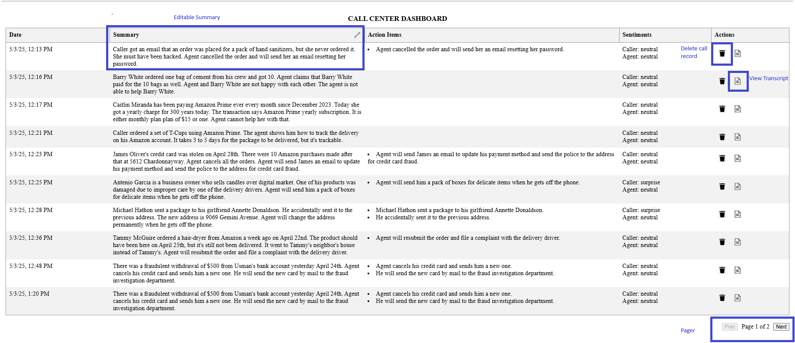
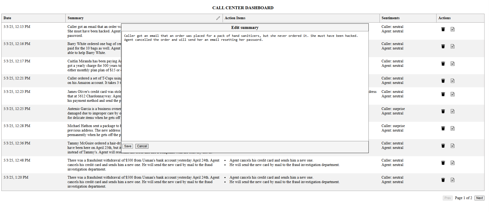
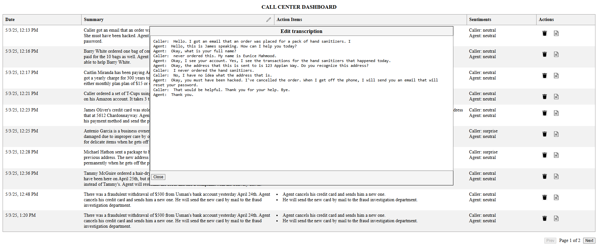

# This  Project

This is a full-stack project with a frontend (Angular) and a backend (Flask).
## Flask-Server

A python server to transcribe and summerize stereo calls. Identifies action items and caller and agent sentiments.
### Features

- Speaker diarization
- AI summarization
- Action item extraction
- Caller and Agent sentiment analysis
- DB CRUD operations (MongoDB)

### Setup instructions

Use the setup.sh under flask-server to setup the python server. Preferable to run on a GPU enabled machine. 

1. Copy the  file to the system: 
    `scp [options] <source> <user>@<host>:<destination>` e.g. `scp setup.sh ubuntu@192.168.1.100:/home/ubuntu/`
If copying to aws EC2, you will need `scp -i <your pem key> ubuntu@ipaddress`

1. Change the permissions on the files:
    ` chmod +x setup.sh`

1. Execute the setup file:
     `./setup.sh`
 
    This should: 
    - install python3, python3-venv, python3-pip, git, mongodb
    - Install mongodb and start it 
    - git clone this repo
    - install all the dependencies for the server
    - Set the following environment variables:
        - export FLASK_APP=app.py
        - export FLASK_RUN_HOST=0.0.0.0
        - export FLASK_RUN_PORT=5000
        - export MONGO_URI="mongodb://localhost:27017/call_DB" (call_DB will be the mongodb database name)
    - start the flask server
1. You can check the status of db as: `sudo systemctl status mongod`

## FRONT END - Call-center-ui

This is an Angular UI to upload stereo calls to the associated flask server and display the information in the tabular format. User has option to:
- Select stereo files for processing,
- View/Edit summaries
- View Action items
- View sentiments of caller and agent
- delete calls
- View the call transcript.

### Build and run the front end

1. Angular requires Node.js and npm (Node Package Manager). To check if you have them installed: 
    `node -v`
    `npm -v`
    If you don't have them installed:

    - Download Node.js (includes npm) from nodejs.org.
    - Follow the installation instructions for your OS.

2. Clone the repo: `git clone https://github.com/tahiraqader/call_center_demo.git`
3. Install angular if you dont have it installed already:`npm install -g @angular/cli@12.2.0`
1. `cd call_center_demo/call-center-ui`
1. Install all the depencies `npm install`
4. Build the app: `ng build --prod`
5. Edit `dist/assets/env.js` setting  `apiUrl` to point to the flask serve. e.g.`apiUrl:'http://localhost:5000'`
6. If you dont have 'serve', install it as `npm install -g serve`
7. Start your app: `serve -s dist/call-center-ui`
8. Load `http://localhost:3000` Or whatever url the `serve` command outputs.

### Usage:
1. Copy the `sample-data`  contents to the system where you are running the angular app. The UI has a button the top left to select a file. Select the file and press 'upload'.
2. Other than the files in the sample data, you can use other stereo files as well.

